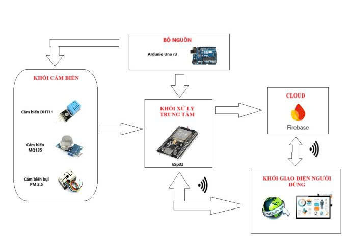

# IoT_Project
**Air Quality Monitoring System** 🌫️📡

## 🔧 Overview
A system to monitor air quality using ESP32, sensors, and Firebase for real-time tracking.

## 🧠 System Architecture

## 📁 Folders
- `Esp32_sensor_firebase`: Code for sensor data collection and Firebase push
- `Code_web`: Web dashboard for visualization
- `MQTT`: MQTT communication module

## 📄 Report
You can find the detailed report in `Báo cáo.pdf`.
